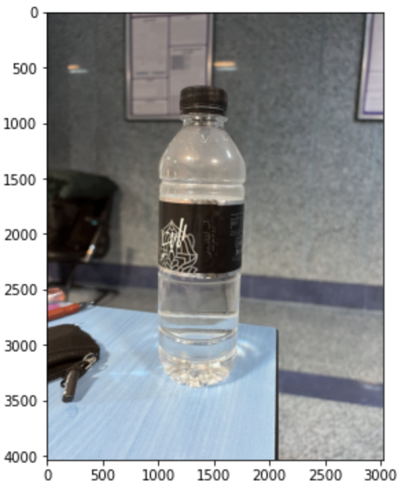
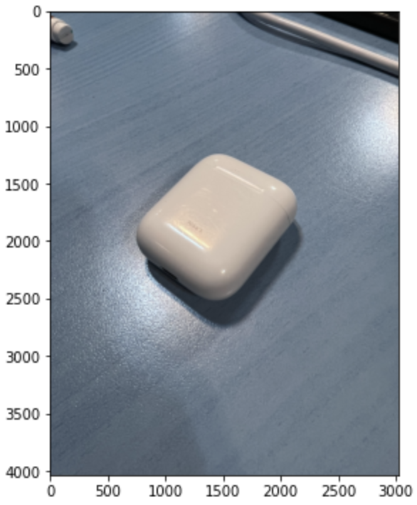
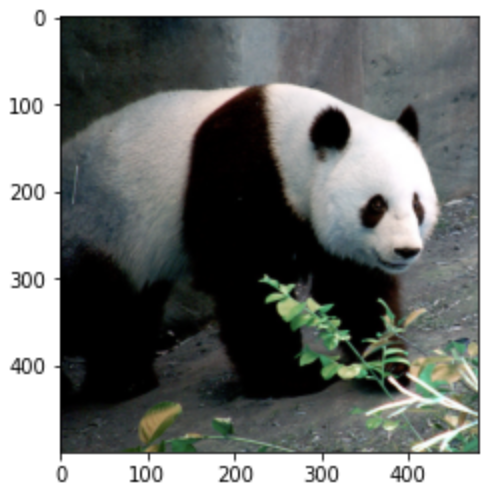
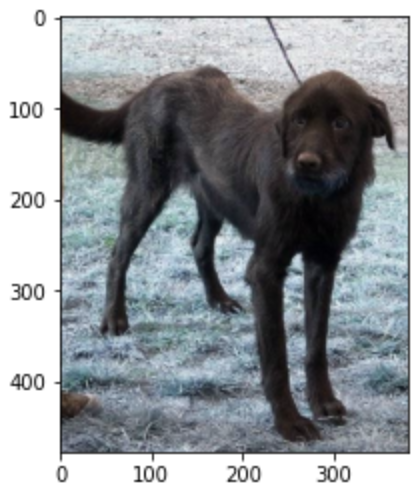

# Transfer Learning for EfficientNet Network

In this project, we use transfer learning with the EfficientNet model to classify images. We begin by preprocessing an image of a water bottle and evaluating the model's predictions.



We define a function `center_crop_and_resize` to prepare the image for the EfficientNet model:

```python
def center_crop_and_resize(image, image_size, crop_padding=32):
    assert image.ndim in {2, 3}

    h, w = image.shape[:2]

    padded_center_crop_size = int(
        (image_size / (image_size + crop_padding)) * min(h, w)
    )
    offset_height = ((h - padded_center_crop_size) + 1) // 2
    offset_width = ((w - padded_center_crop_size) + 1) // 2

    image_crop = image[
                 offset_height: padded_center_crop_size + offset_height,
                 offset_width: padded_center_crop_size + offset_width,
                 ]
    resized_image = resize(
        image_crop,
        (image_size, image_size),
        preserve_range=True,
    )

    return resized_image

```

After implementing the model, we display the top 5 predicted categories for the water bottle:

```
[[('n04557648', 'water_bottle', 0.8388538),
  ('n03983396', 'pop_bottle', 0.04256183),
  ('n03916031', 'perfume', 0.014243271),
  ('n02815834', 'beaker', 0.009039973),
  ('n04254120', 'soap_dispenser', 0.008232178)]]
```

The model correctly identifies the image as a water bottle with 83% probability.

Next, we test the model with an image of an Apple AirPod, which is not among the model’s recognizable categories:



The top 5 predicted categories are:

```
[[('n04116512', 'rubber_eraser', 0.47393715),
  ('n04372370', 'switch', 0.20445324),
  ('n04074963', 'remote_control', 0.09120757),
  ('n03777754', 'modem', 0.062107738),
  ('n03793489', 'mouse', 0.011727708)]]
```

To handle such cases, we add a confidence threshold to filter predictions:

```python
def predict_new_class(Input):
    SIZE = model.input_shape[1]
    x = center_crop_and_resize(Input, SIZE)
    x = preprocess_input(x)
    x = np.expand_dims(x, 0)
    y = model.predict(x)
    predicted = decode_predictions(y)
    threshold = 0.5
    if (predicted[0][0][2] < threshold):
        print('The class of the object is not in the defined labels, so it cannot be predicted correctly')
        print('maximum predicted probability', predicted[0][0][2])
    else:
        print(predicted)
        print('maximum predicted probability', predicted[0][0][2])
```

Results for the water bottle and AirPod images:

```
Predictions for the Water Bottle:
1/1 [==============================] - 0s 40ms/step
[[('n04557648', 'water_bottle', 0.8388538), ('n03983396', 'pop_bottle', 0.04256183), ('n03916031', 'perfume', 0.014243271), ('n02815834', 'beaker', 0.009039973), ('n04254120', 'soap_dispenser', 0.008232178)]]
maximum predicted probability 0.8388538

Predictions for the Airpod Case:
1/1 [==============================] - 0s 23ms/step
The class of the object is not in the defined labels, so it cannot be predicted correctly
maximum predicted probability 0.47393715
```


To improve the model, we retrain it with a custom dataset containing two categories: pandas and dogs, each with at least 200 images. 

Visualizing a picture from each set:

Panda:



Dog:



We modify the EfficientNet architecture by freezing the base layers and adding new fully connected layers to set the final layer size to 2 (because we have 2 classes of pandas or dogs).

```python
base_model = tf.keras.applications.EfficientNetB0(include_top=False, weights="imagenet")
base_model.trainable = False
model= Sequential()
model.add(base_model)  
model.add(tfl.GlobalAveragePooling2D())
model.add(tfl.Dropout(0.2))
model.add(Dense(2,activation=('softmax')))
```

Training results are as follows:

```
Epoch 1/10
8/8 [==============================] - 7s 287ms/step - loss: 0.2254 - accuracy: 0.9042 - val_loss: 0.1517 - val_accuracy: 0.9875
Epoch 2/10
8/8 [==============================] - 1s 101ms/step - loss: 2.0952e-05 - accuracy: 1.0000 - val_loss: 0.1553 - val_accuracy: 0.9875
Epoch 3/10
8/8 [==============================] - 1s 101ms/step - loss: 0.0275 - accuracy: 0.9958 - val_loss: 0.0882 - val_accuracy: 0.9937
Epoch 4/10
8/8 [==============================] - 1s 105ms/step - loss: 1.2914e-08 - accuracy: 1.0000 - val_loss: 0.0292 - val_accuracy: 0.9937
Epoch 5/10
8/8 [==============================] - 1s 101ms/step - loss: 0.1132 - accuracy: 0.9917 - val_loss: 0.0745 - val_accuracy: 0.9937
Epoch 6/10
8/8 [==============================] - 1s 101ms/step - loss: 1.0444e-06 - accuracy: 1.0000 - val_loss: 0.1097 - val_accuracy: 0.9937
Epoch 7/10
8/8 [==============================] - 1s 103ms/step - loss: 0.0000e+00 - accuracy: 1.0000 - val_loss: 0.1262 - val_accuracy: 0.9937
Epoch 8/10
8/8 [==============================] - 1s 103ms/step - loss: 0.0000e+00 - accuracy: 1.0000 - val_loss: 0.1338 - val_accuracy: 0.9937
Epoch 9/10
8/8 [==============================] - 1s 103ms/step - loss: 0.0000e+00 - accuracy: 1.0000 - val_loss: 0.1373 - val_accuracy: 0.9937
Epoch 10/10
8/8 [==============================] - 1s 104ms/step - loss: 0.0000e+00 - accuracy: 1.0000 - val_loss: 0.1388 - val_accuracy: 0.9937
```

As it can be seen, the model achieves high accuracy, demonstrating its effectiveness in distinguishing between pandas and dogs.
